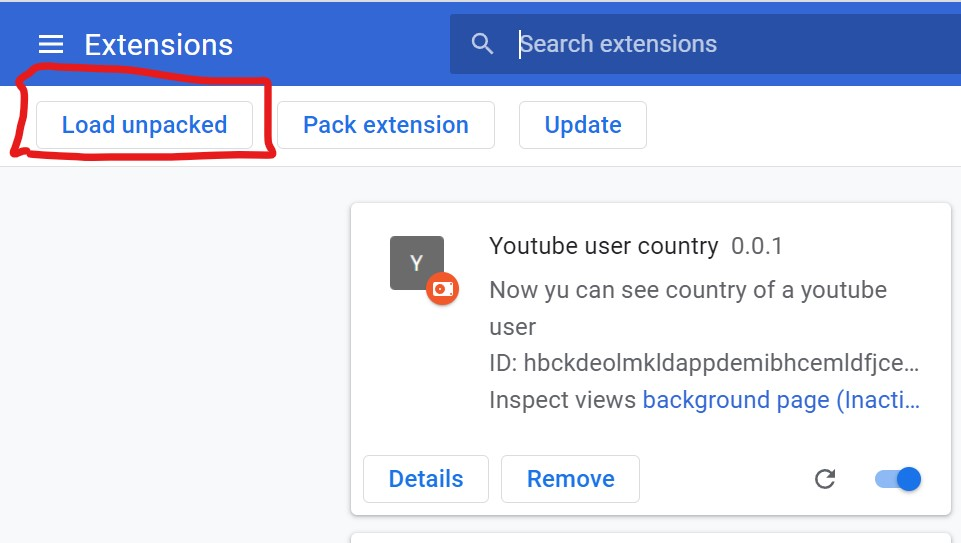

# YtUser-Country
1. Clone the file or download and unzip the file .
2. Switch on the developer mode in chrome>>more tools>>extension .
3. Load the folder from the option appearing on the same page on left top side.

  

4. Go to youtube site .